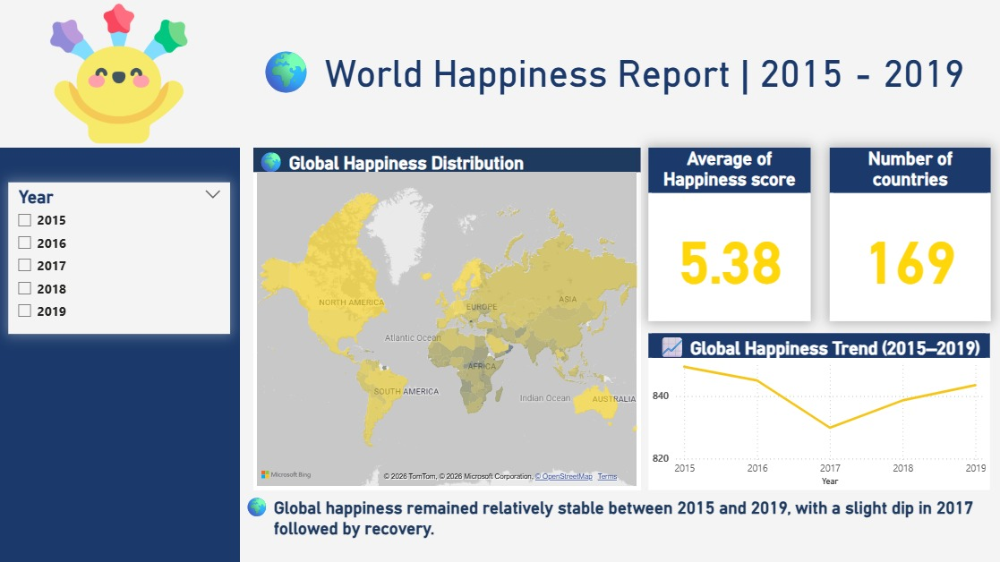
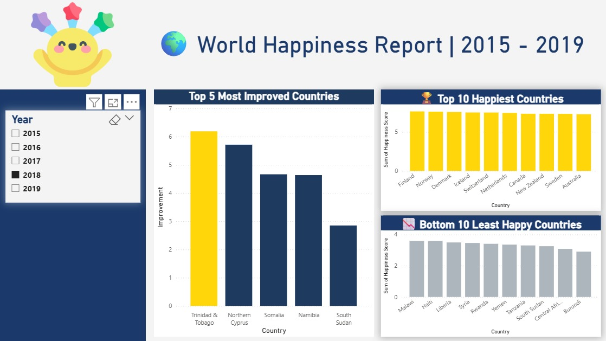
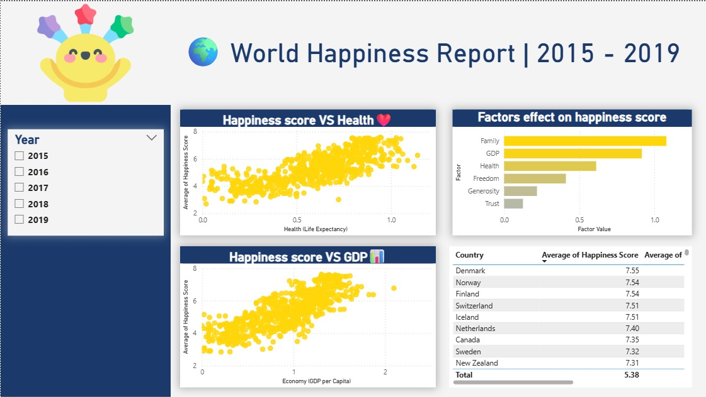

# 🌍 World Happiness Report | 2015 - 2019

<div align="center">


</div>

---

## 📌 Project Overview

> Analyzing **5 years** of World Happiness Report data (2015–2019) across **169 countries** to uncover what truly drives human happiness — from GDP and health to family and freedom.

```python
project = {
    "dataset":    "World Happiness Report (2015–2019)",
    "countries":  169,
    "years":      [2015, 2016, 2017, 2018, 2019],
    "avg_score":  5.38,
    "tools":      ["Python", "Pandas", "Matplotlib", "Power BI"],
    "goal":       "Understand key factors driving happiness worldwide"
}
```

---

## 📊 Dashboard Preview

### 🗺️ Page 1 — Global Overview
> Global happiness distribution map, average score (5.38), trend line 2015–2019, and country count.



### 🏆 Page 2 — Country Rankings
> Top 10 Happiest Countries, Bottom 10 Least Happy, and Top 5 Most Improved Countries.



### 🔬 Page 3 — Correlation Analysis
> Happiness vs Health, Happiness vs GDP, Factors Effect chart, and top country scores table.



---

## 🔍 Key Insights

| # | Insight |
|---|---------|
| 🌟 | **Finland, Norway & Denmark** consistently top the happiness rankings |
| 📉 | Global happiness had a **slight dip in 2017** but recovered by 2019 |
| 👨‍👩‍👧 | **Family** is the #1 factor affecting happiness score — more than GDP |
| 💰 | **GDP per capita** is the 2nd most influential factor |
| ❤️ | Strong **positive correlation** between health/life expectancy and happiness |
| 📈 | **Trinidad & Tobago** showed the most improvement over the period |
| 🇿🇼 | **Burundi & Central African Republic** remain the least happy nations |

---

### Power BI Dashboard Features
- 📅 **Year slicer** — filter all visuals by year (2015–2019)
- 🗺️ **Interactive world map** — color-coded by happiness score
- 📊 **Bar charts** — top/bottom country rankings
- 📈 **Trend line** — global happiness over time
- 🔵 **Scatter plots** — happiness vs GDP, happiness vs health

---

## 📁 Project Structure

```
world-happiness-report/
│
├── 📂 data/
│   ├── 2015.csv
│   ├── 2016.csv
│   ├── 2017.csv
│   ├── 2018.csv
│   └── 2019.csv
│
├── 📂 notebooks/
│   └── analysis.ipynb
│
├── 📂 dashboard/
│   └── WorldHappiness.pbix
│
└── 📄 README.md
```

---

## 📈 Results Summary

<div align="center">

| Metric | Value |
|--------|-------|
| 🌍 Countries Analyzed | 169 |
| 📅 Years Covered | 2015 – 2019 |
| 😊 Global Avg Score | **5.38 / 10** |
| 🏆 Happiest Country | **Finland** |
| 😢 Least Happy | **Burundi** |
| 📈 Most Improved | **Trinidad & Tobago** |
| 🔑 Top Factor | **Family** |

</div>

---

<div align="center">


**Made with 💛 by [Mahmoud](https://github.com/YOUR_USERNAME)**

</div>
